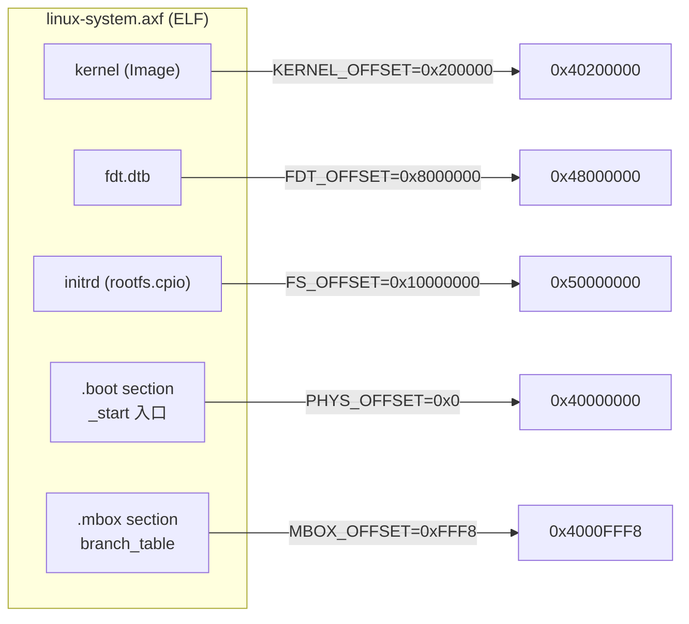
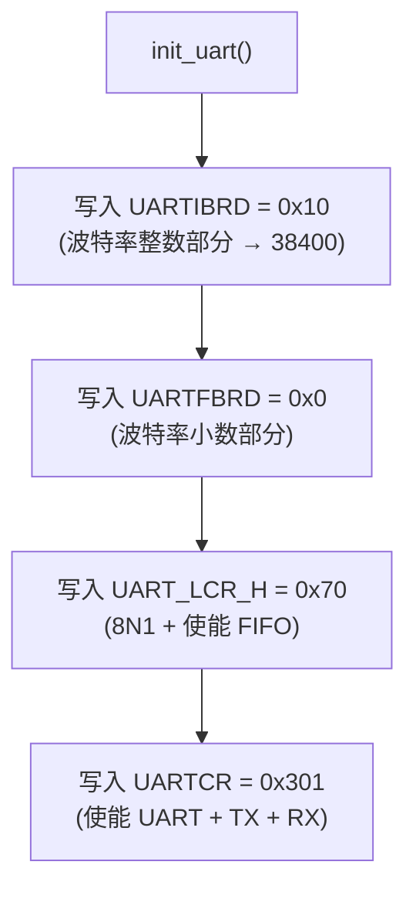
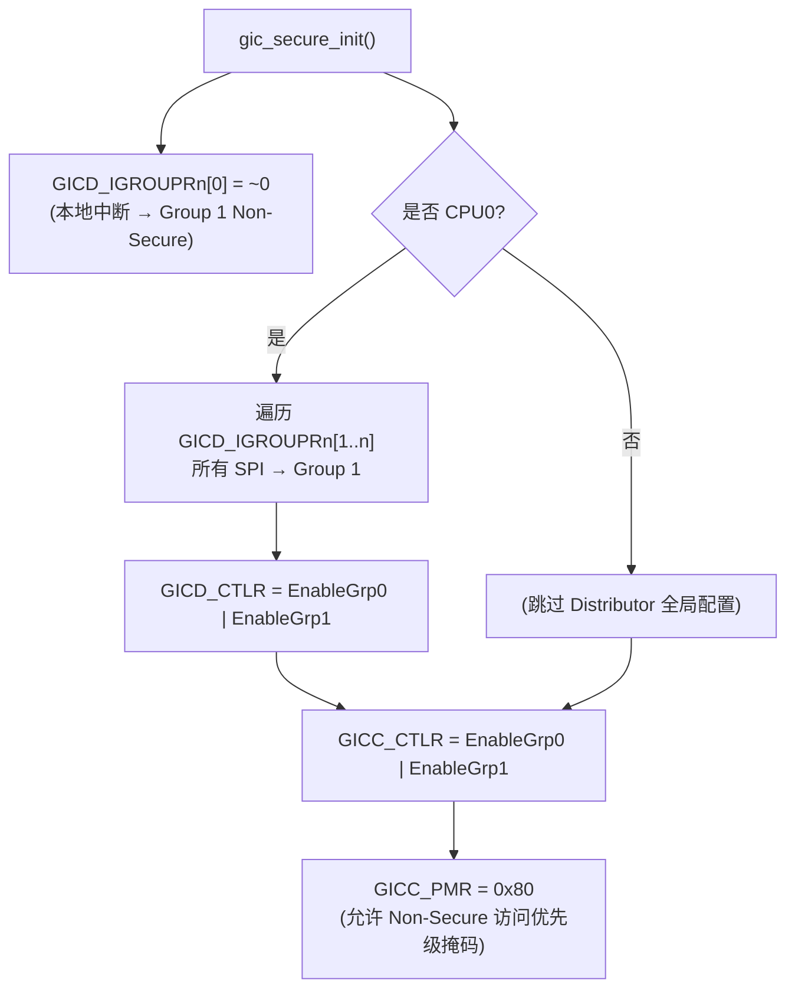
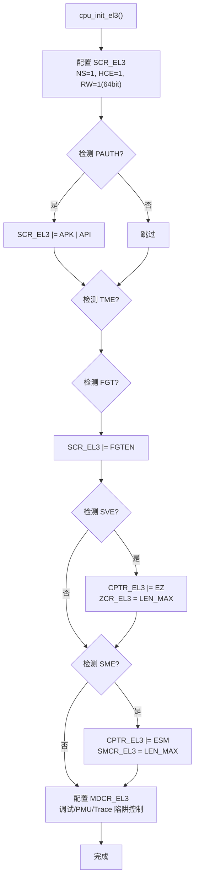
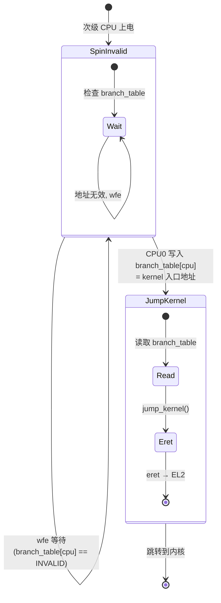
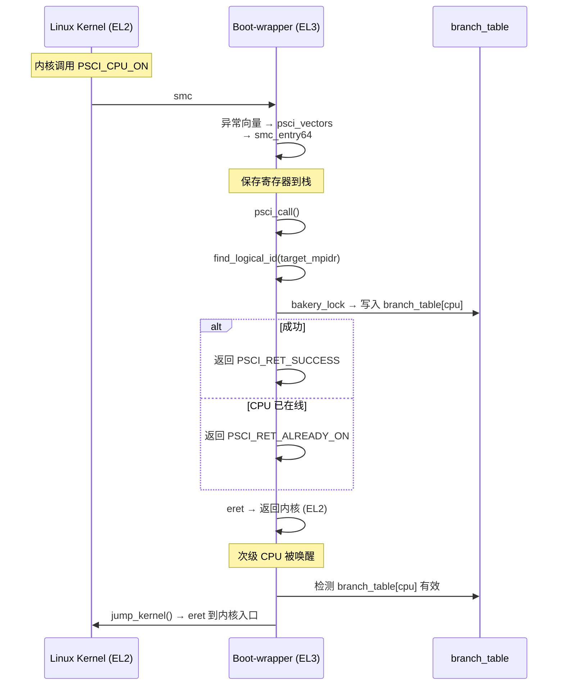
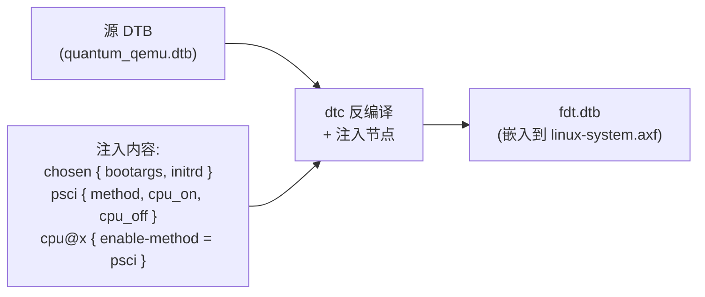
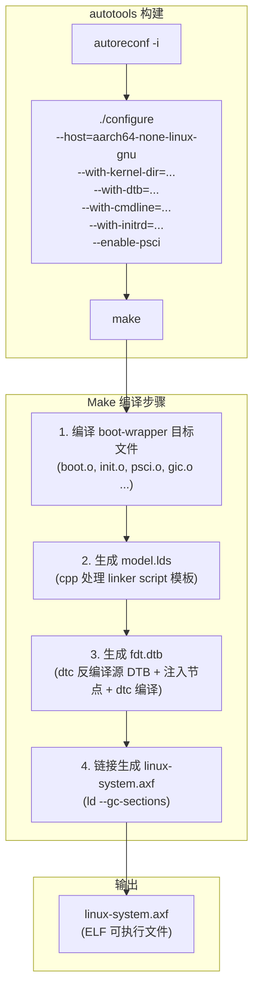
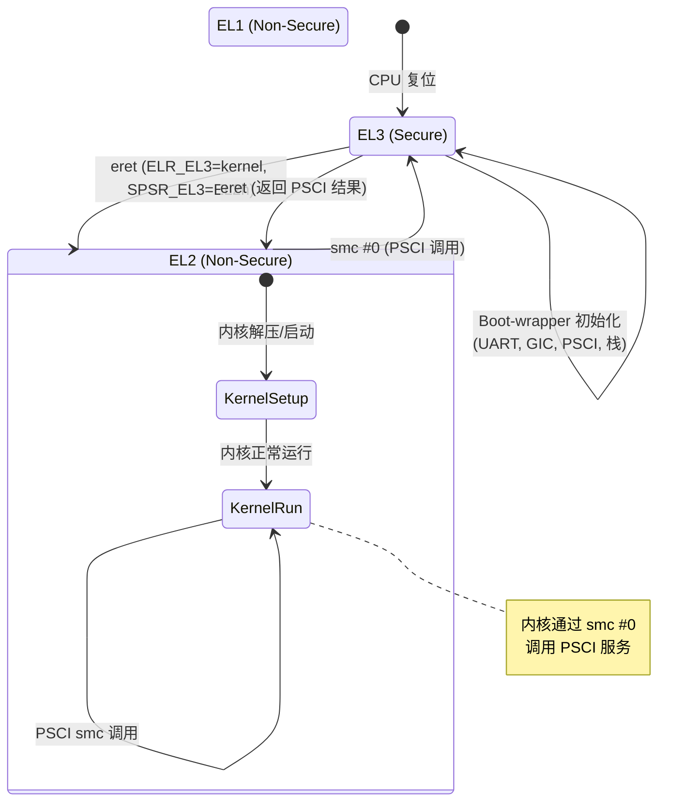

# Boot-wrapper-aarch64 设计文档

## 1. 概述

boot-wrapper-aarch64 是 ARM 官方提供的轻量级引导固件，用于在 AArch64 平台上独立启动 Linux 内核。它将内核镜像（Image）、设备树（DTB）和根文件系统（initrd）打包为单一 ELF 文件 `linux-system.axf`，提供从 CPU 上电到内核入口的完整引导链路。

核心功能：
- 多核 CPU 初始化（PSCI 或 spin-table 启动方法）
- PL011 UART 初始化与调试输出
- GIC（GICv2）安全中断控制器初始化
- 设备树动态修改（注入 chosen、PSCI 节点）
- 异常级别（EL）管理与降级

## 2. 整体启动流程

```mermaid
sequenceDiagram
    participant QEMU as QEMU (virt)
    participant BW as Boot-wrapper
    participant PSCI as PSCI (smc)
    participant Kernel as Linux Kernel

    Note over QEMU: CPU 从 EL3 复位
    QEMU->>BW: 跳转到 0x40000000 (_start)

    rect rgb(230, 245, 255)
        Note over BW: Primary CPU (CPU0)
        BW->>BW: 检测当前 EL (EL3)
        BW->>BW: 配置 SCTLR_EL3
        BW->>BW: 读取 MPIDR_EL1
        BW->>BW: find_logical_id() → CPU0
        BW->>BW: setup_stack()
        BW->>BW: init_uart() → PL011 38400 8N1
        BW->>BW: 打印 "Boot-wrapper v0.2"
        BW->>BW: 打印内存布局
        BW->>BW: cpu_init_arch() → 配置 EL3 寄存器
        BW->>BW: gic_secure_init()
        BW->>BW: 设置 VBAR_EL3 → psci_vectors
    end

    rect rgb(255, 245, 230)
        Note over BW: Secondary CPUs (CPU1-3)
        BW->>>BW: CPU1-3 上电, 进入 _start
        BW->>>BW: find_logical_id() → CPU1/2/3
        BW->>>BW: setup_stack()
        BW->>>BW: 等待 CPU0 完成初始化 (wfe)
        BW->>>BW: cpu_init_arch()
        BW->>>BW: 通知 CPU0 完成 (sev)
    end

    rect rgb(230, 255, 230)
        Note over BW: Primary CPU 跳转内核
        BW->>BW: 等待所有 CPU 就绪
        BW->>BW: 打印 "All CPUs initialized"
        BW->>BW: first_spin() → entrypoint=kernel__start
        BW->>BW: 配置 SCTLR_EL1, SCTLR_EL2
        BW->>BW: msr ELR_EL3 = kernel 入口地址
        BW->>BW: msr SPSR_EL3 = EL2h 模式
        BW->>BW: eret → 降级到 EL2
    end

    rect rgb(255, 230, 240)
        Note over Kernel: Linux 内核启动
        BW->>Kernel: x0 = DTB 地址
        Kernel->>Kernel: 解析 DTB, 发现 PSCI (smc)
        Kernel->>PSCI: PSCI_CPU_ON (0xc4000003) 唤醒 CPU1
        PSCI->>BW: SMC 异常 → psci_vectors
        BW->>BW: psci_cpu_on() 写入 branch_table
        BW->>BW: eret 返回内核
        Kernel->>BW: CPU1 读取 branch_table
        BW->>Kernel: CPU1 跳转到内核入口
        Note over Kernel: CPU2, CPU3 同理
    end
```

## 3. 内存布局

### 3.1 实际内存映射（QEMU virt + quantum_qemu）

```mermaid
block-beta
    columns 4
    block:MEM["物理内存 0x40000000 - 0xBFFFFFFF (2GB)"]:columns 1
        block:BOOT["boot-wrapper + kernel + dtb + initrd"]:columns 1
            BW["boot-wrapper 代码<br/>(text/data/bss/stack)<br/>0x40000000<br/>~7KB"]
            KERNEL["Linux 内核 Image<br/>0x40200000<br/>~8.3MB"]
            DTB["修改后的 DTB (fdt.dtb)<br/>0x48000000<br/>~8KB"]
            INITRD["initrd (rootfs.cpio)<br/>0x50000000<br/>~50MB"]
        end
        MBOX["Mailbox<br/>0x4000FFF8<br/>8 bytes"]
        MEMDISK["Memdisk (预留)<br/>0x78000000<br/>256MB"]
        FREE["可用内存<br/>0x58000000 - 0x77FFFFFF"]
    end
```

### 3.2 各区域偏移与大小

| 区域 | 起始地址 | 偏移量 | 来源 |
|------|---------|--------|------|
| `PHYS_OFFSET` | `0x40000000` | — | DTB `memory` 节点的第一个 bank |
| `.boot` (boot-wrapper) | `PHYS_OFFSET + 0x0` | `0x0` | 链接脚本 `model.lds.S` |
| `.mbox` (mailbox) | `PHYS_OFFSET + 0xFFF8` | `MBOX_OFFSET=0xFFF8` | PSCI branch_table |
| `kernel` (Image) | `PHYS_OFFSET + 0x200000` | `KERNEL_OFFSET` | 由 `aa64-load-offset.pl` 计算，保证 TEXT 对齐 |
| `dtb` (fdt.dtb) | `PHYS_OFFSET + 0x8000000` | `FDT_OFFSET=0x8000000` | 固定偏移 |
| `filesystem` (initrd) | `PHYS_OFFSET + 0x10000000` | `FS_OFFSET=0x10000000` | 固定偏移 |
| `TEXT_LIMIT` | `0x80000` (512KB) | — | boot-wrapper 代码最大尺寸约束 |

### 3.3 链接脚本内存排列



> 注意：链接脚本中 `.boot` 放在最后，但运行时加载地址在最前面（`PHYS_OFFSET`）。ELF 入口点 `_start` 位于 `0x40000000`。

### 3.4 initrd 地址计算

initrd 在 DTB chosen 节点中的地址：

```
FILESYSTEM_START = PHYS_OFFSET + FS_OFFSET = 0x40000000 + 0x10000000 = 0x50000000
FILESYSTEM_END   = FILESYSTEM_START + rootfs.cpio 文件大小
```

这些值在编译时通过 `Makefile.am` 计算并嵌入到 `fdt.dtb` 的 `chosen` 节点：

```dts
chosen {
    bootargs = "console=ttyAMA0 init=/init ...";
    linux,initrd-start = <0x50000000>;
    linux,initrd-end   = <0x53160a00>;
};
```

## 4. 硬件操作

### 4.1 PL011 UART

boot-wrapper 使用 DTB 中的第一个 `arm,pl011` 兼容设备作为调试串口。

**初始化流程** (`platform.c:init_uart`):



**寄存器映射**（基地址从 DTB 解析）:

| 寄存器 | 偏移 | 用途 |
|--------|------|------|
| `UARTDR` | `0x00` | 数据寄存器（收发字符） |
| `UARTFR` | `0x18` | 标志寄存器（BUSY/FIFO_FULL） |
| `UARTIBRD` | `0x24` | 波特率整数部分 |
| `UARTFBRD` | `0x28` | 波特率小数部分 |
| `UART_LCR_H` | `0x2C` | 行控制寄存器 |
| `UARTCR` | `0x30` | 控制寄存器 |

QEMU virt 平台 UART 基地址：`0x9000000`

### 4.2 GICv2 中断控制器

仅在 EL3 入口时初始化安全中断控制器（`gic.c:gic_secure_init`）。

**寄存器地址**（从 DTB 解析）:

| 组件 | QEMU virt 地址 | 用途 |
|------|---------------|------|
| GIC Distributor | `0x8000000` | 中断路由与分发 |
| GIC CPU Interface | `0x8010000` | CPU 中断控制 |

**初始化流程**:



### 4.3 通用定时器

```c
msr(CNTFRQ_EL0, COUNTER_FREQ);  // 100MHz
```

设置 `CNTFRQ_EL0` 为 `100000000`（100MHz），供内核使用。

### 4.4 ARMv8 系统寄存器配置（EL3 初始化）

`cpu_init_el3()` 配置了完整的 EL3 运行环境：



关键 SCR_EL3 位：
- `SCR_EL3_NS` (bit 0): Non-Secure 状态
- `SCR_EL3_HCE` (bit 8): 使能 HVC 指令
- `SCR_EL3_RW` (bit 10): EL2/EL1 执行状态为 AArch64
- `SCR_EL3_FGTEN` (bit 27): 使能 Fine-Grained Trap

### 4.5 CPU 栈

每个 CPU 独立的栈空间，位于 `.boot` section 的 `.stack` 区域：

```mermaid
block-beta
    columns 1
    block:STACK[".stack 区域"]:columns 1
        S3["CPU3 stack<br/>256 bytes"]
        S2["CPU2 stack<br/>256 bytes"]
        S1["CPU1 stack<br/>256 bytes"]
        S0["CPU0 stack<br/>256 bytes"]
    end
```

栈分配公式：`sp = stack_top - cpu_id * STACK_SIZE`

`STACK_SIZE = 256`，`NR_CPUS = 4`

## 5. PSCI 实现

### 5.1 PSCI 启动方法



### 5.2 SMC 调用链



### 5.3 PSCI 接口

| Function ID | 功能 | 参数 |
|------------|------|------|
| `0x84000002` | PSCI_CPU_OFF | 无（当前 CPU 自身关闭） |
| `0xc4000003` | PSCI_CPU_ON (AArch64) | x1=target_mpidr, x2=entry_address |

调用约定：通过 `smc #0` 指令触发，`method = "smc"` 在 DTB psci 节点中声明。

### 5.4 Bakery Lock

PSCI 使用 Bakery Lock 算法保护 `branch_table` 的并发访问。每个 CPU 维护一个 ticket，按 ticket 顺序获取锁，保证多核安全。

## 6. DTB 动态修改

boot-wrapper 不直接修改源 DTB，而是通过 `dtc` 在编译时生成一个新的 `fdt.dtb`：

### 6.1 注入的节点



### 6.2 具体修改内容

```dts
/* 添加到根节点 */
/ {
    chosen {
        bootargs = "console=ttyAMA0 init=/init nokaslr earlycon=pl011,0x9000000 debug loglevel=8";
        linux,initrd-start = <0x50000000>;
        linux,initrd-end   = <0x53160a00>;
    };

    psci {
        compatible = "arm,psci";
        method = "smc";
        cpu_on  = <0xc4000003>;
        cpu_off = <0x84000002>;
    };

    /* 修改所有 CPU 节点 */
    &{/cpus/cpu@0} { enable-method = "psci"; };
    &{/cpus/cpu@1} { enable-method = "psci"; };
    &{/cpus/cpu@2} { enable-method = "psci"; };
    &{/cpus/cpu@3} { enable-method = "psci"; };
};
```

### 6.3 DTB 参数自动提取

编译时通过 Perl 脚本从源 DTB 自动提取硬件参数：

| 脚本 | 提取内容 | 用途 |
|------|---------|------|
| `findmem.pl` | `memory` 节点首地址 | `PHYS_OFFSET` |
| `findbase.pl` (pl011) | UART 基地址 | `UART_BASE` (PL011 初始化) |
| `findbase.pl` (cortex-a15-gic) | GIC Distributor/CPU 基地址 | `GIC_DIST_BASE`, `GIC_CPU_BASE` |
| `findcpuids.pl` | CPU 的 reg 属性 | `CPU_IDS` (逻辑 ID 映射) |
| `aa64-load-offset.pl` | Image 的 TEXT 段对齐要求 | `KERNEL_OFFSET` |

## 7. 构建流程



## 8. 异常级别转换

boot-wrapper 从 EL3 启动，最终将内核降级到 EL2 执行：



### jump_kernel 详细流程

```asm
// arch/aarch64/boot.S: jump_kernel
mov  x19, x0              // 保存内核入口地址
// ... 保存参数 x1-x4
msr  sctlr_el1, x0         // 配置 EL1 系统控制寄存器
msr  sctlr_el2, x0         // 配置 EL2 系统控制寄存器
// ... 恢复参数
mov  x4, #SPSR_KERNEL      // SPSR = EL2h (EL2, Handler mode)
msr  elr_el3, x19          // 异常返回地址 = 内核入口
msr  spsr_el3, x4          // 异常返回后的 PSTATE
eret                      // 降级到 EL2，跳转到内核
```

## 9. 配置参数参考（quantum_qemu）

| 参数 | 值 | 来源 |
|------|-----|------|
| QEMU Machine | `virt` | board conf |
| QEMU Machine 选项 | `secure=on,virtualization=on` | boot-wrapper 要求 |
| CPU | `cortex-a57` | board conf |
| SMP | 4 | board conf |
| 内存 | 1024MB | board conf |
| 交叉编译 | `aarch64-none-linux-gnu` | envsetup.sh |
| 内核版本 | `6.1.0` | board conf |
| DTB | `quantum/quantum_qemu.dtb` | board conf |
| UART 基地址 | `0x9000000` | 从 DTB 自动提取 |
| GIC Distributor | `0x8000000` | 从 DTB 自动提取 |
| GIC CPU Interface | `0x8010000` | 从 DTB 自动提取 |
| COUNTER_FREQ | `100MHz` | Makefile.am 固定 |
| STACK_SIZE | `256 bytes` | Makefile.am 固定 |
