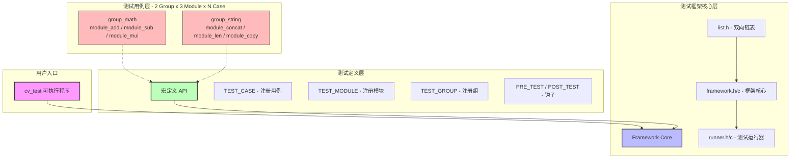
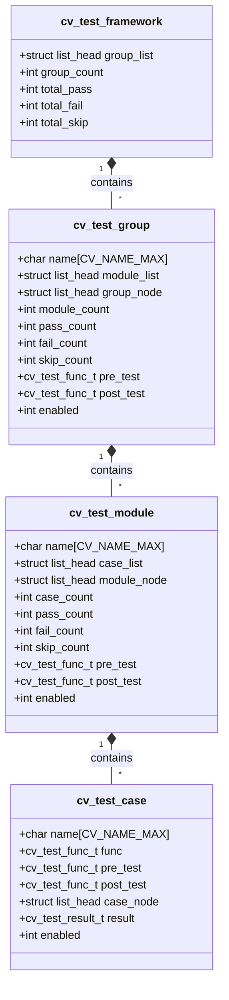
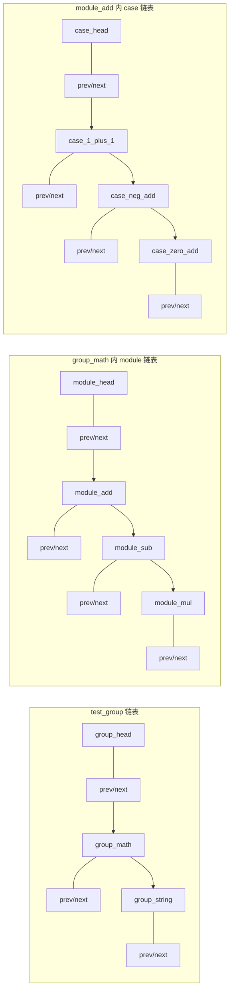
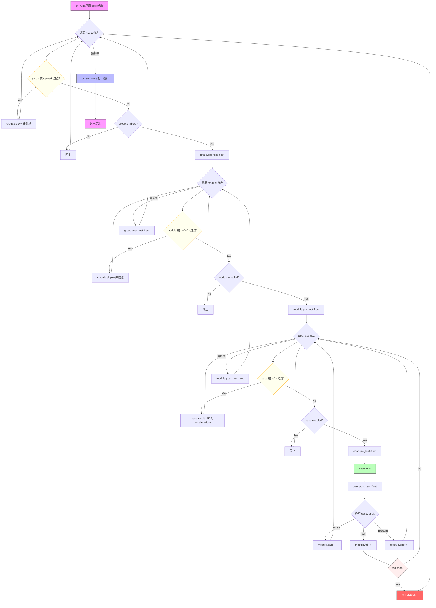
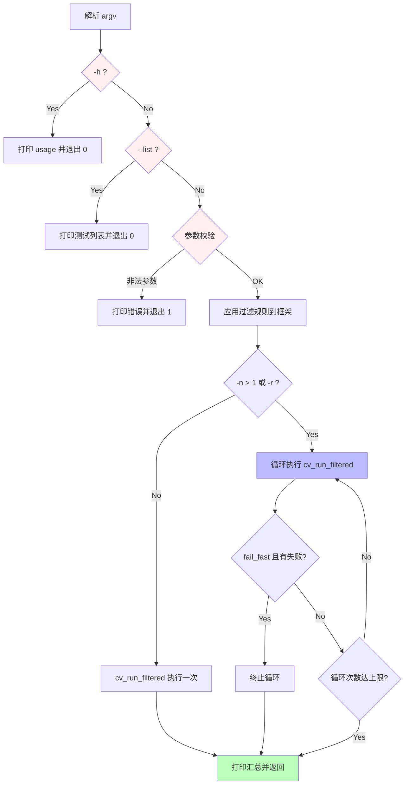
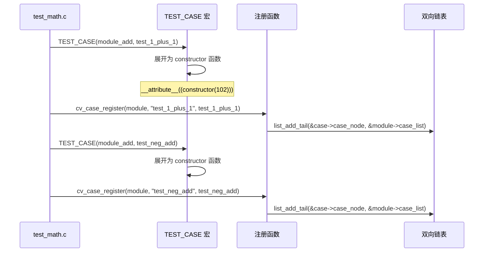
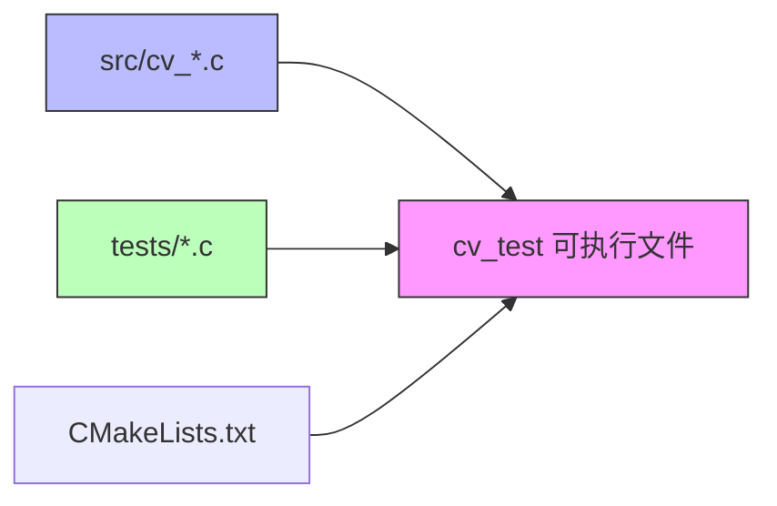
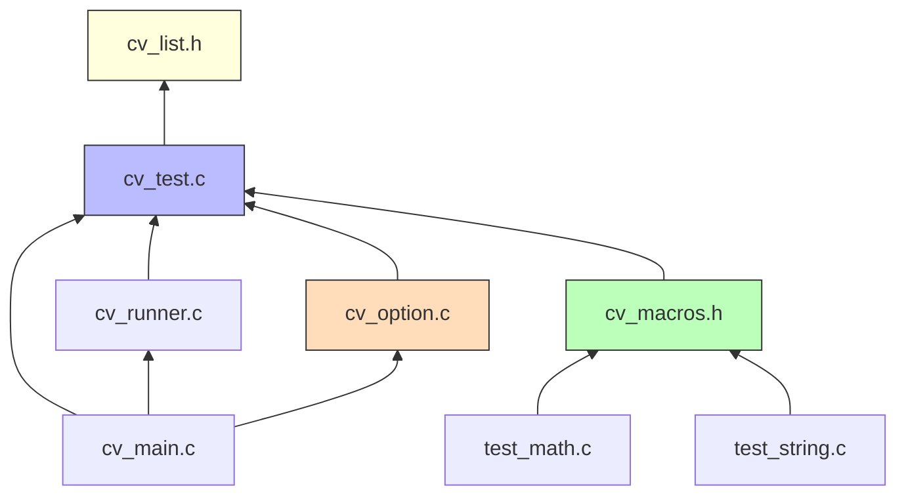

# CV Test Framework - 架构及模块设计

## 1. 总体架构



---

## 2. 核心数据结构

### 2.1 三层结构关系



### 2.2 双向链表节点布局



---

## 3. 目录结构

```
cv_framework/
├── CMakeLists.txt           # 顶层 CMake 配置
├── include/
│   ├── cv_list.h            # Linux 风格双向链表
│   ├── cv_test.h            # 框架核心数据结构与 API 声明
│   ├── cv_option.h          # 命令行参数结构体与解析 API
│   └── cv_macros.h          # 用户层便捷宏定义
├── src/
│   ├── cv_test.c            # 框架核心实现（注册、运行、统计）
│   ├── cv_runner.c          # 测试运行器（遍历链表、调用钩子）
│   ├── cv_option.c          # 命令行参数解析
│   └── cv_main.c            # main 入口
├── tests/
│   ├── CMakeLists.txt       # 测试子目录 CMake
│   ├── test_math.c          # group_math: 加减乘模块
│   └── test_string.c        # group_string: 拼接/长度/拷贝模块
└── build/                   # CMake out-of-source 构建目录
    └── cv_test              # 编译产物
```

---

## 4. 模块职责

### 4.1 `cv_list.h` — 双向链表

仿 Linux kernel `list_head`，提供：

| 函数 | 说明 |
|------|------|
| `LIST_HEAD(name)` | 定义并初始化链表头 |
| `INIT_LIST_HEAD(ptr)` | 初始化链表头 |
| `list_add(new, head)` | 头插法 |
| `list_add_tail(new, head)` | 尾插法 |
| `list_del(entry)` | 从链表中移除 |
| `list_entry(ptr, type, member)` | 通过成员指针获取宿主结构体 |
| `list_for_each(pos, head)` | 正向遍历 |
| `list_for_each_prev(pos, head)` | 反向遍历 |
| `list_for_each_safe(pos, n, head)` | 安全遍历（可中途删除） |

### 4.2 `cv_test.h` — 核心数据结构与 API

```c
#include "cv_list.h"
#include <stddef.h>

/* ---- 类型与常量 ---- */

#define CV_NAME_MAX    64
#define CV_ERR_MSG_MAX 256

typedef void (*cv_test_func_t)(void);

typedef enum {
    CV_RESULT_UNINIT = -1,   /* 未执行 */
    CV_RESULT_PASS   = 0,    /* 通过   */
    CV_RESULT_FAIL   = 1,    /* 失败   */
    CV_RESULT_SKIP   = 2,    /* 跳过   */
    CV_RESULT_ERROR  = 3,    /* 异常   */
} cv_test_result_t;

/* ---- cv_test_case：最小执行单位 ----
 *
 * pre_test / post_test 在 func 前后调用，用于单个用例级的
 * 资源准备与清理（如 mock 初始化、临时文件创建等）。
 * enabled=0 时跳过该用例（结果记为 SKIP）。
 */
typedef struct cv_test_case {
    char                name[CV_NAME_MAX];      /* 用例名称          */
    cv_test_func_t      func;                   /* 测试函数          */
    cv_test_func_t      pre_test;               /* 用例前置回调      */
    cv_test_func_t      post_test;              /* 用例后置回调      */
    struct list_head    case_node;              /* 链接: module->case_list */
    cv_test_result_t    result;                 /* 执行结果          */
    char                errmsg[CV_ERR_MSG_MAX]; /* 失败时的描述信息    */
    int                 enabled;                /* 1=执行, 0=跳过    */
} cv_test_case_t;

/* ---- cv_test_module：包含多个 test_case ----
 *
 * pre_test / post_test 在遍历本模块所有用例的前后各调用一次，
 * 适合模块级的资源分配与释放。
 * enabled=0 时跳过整个模块及其所有用例。
 */
typedef struct cv_test_module {
    char                name[CV_NAME_MAX];       /* 模块名称          */
    struct list_head    case_list;               /* 头: 挂载 cv_test_case  */
    struct list_head    module_node;             /* 链接: group->module_list */
    int                 case_count;              /* 注册的用例总数      */
    int                 pass_count;              /* 通过数             */
    int                 fail_count;              /* 失败数             */
    int                 skip_count;              /* 跳过数             */
    int                 error_count;             /* 异常数             */
    cv_test_func_t      pre_test;                /* 模块前置回调       */
    cv_test_func_t      post_test;               /* 模块后置回调       */
    int                 enabled;                 /* 1=执行, 0=跳过     */
} cv_test_module_t;

/* ---- cv_test_group：包含多个 test_module ----
 *
 * pre_test / post_test 在遍历本组所有模块的前后各调用一次，
 * 适合组级的全局初始化与清理。
 * enabled=0 时跳过整个组及其所有模块/用例。
 */
typedef struct cv_test_group {
    char                name[CV_NAME_MAX];       /* 组名称            */
    struct list_head    module_list;             /* 头: 挂载 cv_test_module  */
    struct list_head    group_node;              /* 链接: framework->group_list */
    int                 module_count;            /* 注册的模块总数      */
    int                 pass_count;              /* 通过数（含子模块）  */
    int                 fail_count;              /* 失败数             */
    int                 skip_count;              /* 跳过数             */
    int                 error_count;             /* 异常数             */
    cv_test_func_t      pre_test;                /* 组前置回调         */
    cv_test_func_t      post_test;               /* 组后置回调         */
    int                 enabled;                 /* 1=执行, 0=跳过     */
} cv_test_group_t;

/* ---- cv_test_framework：全局单例 ---- */
typedef struct cv_test_framework {
    struct list_head    group_list;              /* 头: 挂载 cv_test_group  */
    int                 group_count;             /* 注册的组总数        */
    int                 total_pass;
    int                 total_fail;
    int                 total_skip;
    int                 total_error;
    int                 total_run;               /* 实际执行的用例数    */
} cv_test_framework_t;

/* ---- 公共 API ---- */

/* 获取框架全局单例 */
cv_test_framework_t *cv_framework_get(void);

/* 注册（使用 constructor 宏自动调用，也可手动调用） */
cv_test_group_t  *cv_group_register(const char *name);
cv_test_module_t *cv_module_register(cv_test_group_t *group, const char *name);
cv_test_case_t   *cv_case_register(cv_test_module_t *module,
                                    const char *name, cv_test_func_t func);

/* 设置钩子（pre_test / post_test 传 NULL 表示不设置） */
void cv_group_set_hooks(cv_test_group_t  *g,
                        cv_test_func_t pre_test, cv_test_func_t post_test);
void cv_module_set_hooks(cv_test_module_t *m,
                         cv_test_func_t pre_test, cv_test_func_t post_test);
void cv_case_set_hooks(cv_test_case_t   *c,
                       cv_test_func_t pre_test, cv_test_func_t post_test);

/* 启用/禁用 */
void cv_group_enable(cv_test_group_t  *g,  int enable);
void cv_module_enable(cv_test_module_t *m, int enable);
void cv_case_enable(cv_test_case_t   *c,  int enable);

/* 运行 */
int  cv_run(const cv_test_opts_t *opts);
int  cv_run_all(void);  /* 等价于 cv_run(&default_opts) */
void cv_summary(void);
void cv_list_tests(int detail);
void cv_apply_filters(const cv_test_opts_t *opts);
```

### 4.3 `cv_macros.h` — 用户便捷宏

注册宏与钩子宏均使用 `__attribute__((constructor))` 自动注册，
优先级：group(101) < module(102) < case(103) < hooks(104)。
静态变量直接使用用户提供的名称（如 `group_math`、`module_add`），
便于在钩子宏和用例函数中引用。

```c
/* ---- 注册宏 ---- */

#define TEST_GROUP(name)                                               \
    static cv_test_group_t *name;                                     \
    __attribute__((constructor(101)))                                   \
    static void __cv_reg_grp_##name(void) {                            \
        name = cv_group_register(#name);                               \
    }

#define TEST_MODULE(group, name)                                       \
    static cv_test_module_t *name;                                    \
    __attribute__((constructor(102)))                                   \
    static void __cv_reg_mod_##name(void) {                            \
        name = cv_module_register(group, #name);                       \
    }

#define TEST_CASE(module, name)                                        \
    static void name(void);                                            \
    static cv_test_case_t *name##_cvcase;                              \
    __attribute__((constructor(103)))                                   \
    static void __cv_reg_case_##name(void) {                           \
        name##_cvcase = cv_case_register(module, #name, name);        \
    }                                                                  \
    static void name(void)

/* ---- 钩子宏（constructor(104)，必须在文件作用域使用） ---- */

#define GROUP_PRE_TEST(grp, fn)                                        \
    __attribute__((constructor(104)))                                   \
    static void __cv_gpre_##grp##_##fn(void) {                        \
        cv_group_set_hooks(grp, fn, NULL);                             \
    }

/* MODULE_PRE_TEST / MODULE_POST_TEST / CASE_PRE_TEST / CASE_POST_TEST 同理 */

/* ---- 断言宏 ---- */

#define CV_ASSERT(cond)                       do {                                     \
        if (!(cond)) {                                                               \
            cv_test_current_case_fail(__FILE__, __LINE__, #cond);                    \
        }                                                                           \
    } while (0)

#define CV_ASSERT_EQ(a, b)                   do {                                     \
        long _ea = (long)(a), _eb = (long)(b);                                       \
        if (_ea != _eb) {                                                            \
            char _ebuf[CV_ERR_MSG_MAX];                                              \
            snprintf(_ebuf, sizeof(_ebuf), "%s != %s (%ld vs %ld)",               \
                     #a, #b, _ea, _eb);                                               \
            cv_test_current_case_fail(__FILE__, __LINE__, _ebuf);                    \
        }                                                                           \
    } while (0)

#define CV_ASSERT_NE(a, b)    /* 类似 CV_ASSERT_EQ，判断不相等 */
#define CV_ASSERT_NULL(ptr)   CV_ASSERT((ptr) == NULL)
#define CV_ASSERT_NOT_NULL(ptr) CV_ASSERT((ptr) != NULL)
```

### 4.4 `cv_runner.c` — 运行器

执行流程：



### 4.5 `cv_option.h/c` — 命令行参数解析

#### 4.5.1 参数总览

```
用法: cv_test [选项]

测试选择:
  -g, --group <name[,...]>       仅运行指定 group（逗号分隔）
  -m, --module <name[,...]>      仅运行指定 module（逗号分隔）
  -c, --case <name[,...]>        仅运行指定 case（逗号分隔）
  -k, --filter <pattern>         按通配符模式过滤 case 名称（如 "test_*_add"）

执行控制:
  -n, --count <num>              重复执行次数（默认 1，用于稳定性测试）
  -r, --repeat                   持续重复直到出现失败（压力/回归测试）
  -f, --fail-fast                首个失败后立即停止
      --shuffle                  随机打乱执行顺序

输出控制:
  -v, --verbose                  显示详细信息（pre/post_test 调用、耗时等）
  -s, --silent                   仅输出汇总摘要
      --list                     列出所有已注册的 group/module/case
      --list-detail              列出详细信息（含 enabled 状态、case 数量）
      --color                    彩色输出（默认终端自动检测）
      --no-color                 关闭彩色输出

其他:
  -h, --help                     显示帮助信息
```

#### 4.5.2 参数组合规则

| 组合 | 效果 |
|------|------|
| 无参数 | 运行所有已注册的 group → module → case |
| `-g group_math` | 仅运行 group_math 及其下所有 module/case |
| `-g group_math -m module_add` | 仅运行 group_math.module_add 及其下所有 case |
| `-g group_math -c test_1_plus_1` | 仅运行 group_math 下的 test_1_plus_1 |
| `-m module_add` | 在所有 group 中搜索名为 module_add 的模块 |
| `-k "test_*_add"` | 在所有 module 中匹配名称以 test_*_add 的 case |
| `-n 1000` | 全部测试重复 1000 次（统计每轮结果） |
| `-r` | 持续循环，直到某个 case 失败或用户 Ctrl+C |
| `-f -v` | 首次失败即停，并输出详细日志 |

参数优先级：`--case` > `--module` > `--group` > `--filter`，指定更精确的过滤会覆盖上层过滤。

#### 4.5.3 选项结构体

```c
#define CV_MAX_FILTERS   32

typedef struct cv_test_opts {
    /* --- 测试选择 --- */
    char    *groups[CV_MAX_FILTERS];   /* -g 指定的 group 名称数组  */
    int      group_count;              /* group 名称数量             */
    char    *modules[CV_MAX_FILTERS];  /* -m 指定的 module 名称数组 */
    int      module_count;
    char    *cases[CV_MAX_FILTERS];    /* -c 指定的 case 名称数组   */
    int      case_count;
    char    *filter;                   /* -k 通配符模式             */

    /* --- 执行控制 --- */
    int      repeat_count;             /* -n 重复次数（0=无限，即 -r 模式） */
    int      fail_fast;                /* -f 首次失败即停           */
    int      shuffle;                  /* --shuffle 随机打乱         */

    /* --- 输出控制 --- */
    int      verbose;                  /* -v 详细输出               */
    int      silent;                   /* -s 静默输出               */
    int      list_only;                /* --list 列出测试            */
    int      list_detail;              /* --list-detail 详细列出     */
    int      color;                    /* --color/--no-color（-1=自动检测） */
} cv_test_opts_t;

/* 解析命令行参数，填充 opts 结构体 */
int  cv_option_parse(int argc, char *argv[], cv_test_opts_t *opts);
void cv_option_print_usage(const char *prog);
void cv_option_free(cv_test_opts_t *opts);
```

#### 4.5.4 参数解析流程



#### 4.5.5 重复执行与统计

`-n` / `-r` 模式下，每轮执行前重置所有 case/module/group 的统计计数器，
框架额外维护轮次统计：

```c
/* 附加到 cv_test_framework 中用于多轮统计 */
typedef struct cv_round_stat {
    int round;           /* 当前轮次           */
    int rounds_passed;   /* 全部通过的轮次数   */
    int rounds_failed;   /* 存在失败的轮次数   */
    int worst_pass;      /* 单轮最低通过率     */
    int worst_fail;      /* 单轮最高失败数     */
} cv_round_stat_t;
```

输出示例（`-n 5`）：

```
===========================================
  CV Test Framework v1.0  [Round 1/5]
===========================================
...
===========================================
  CV Test Framework v1.0  [Round 5/5]
===========================================

===========================================
  ROUND SUMMARY
===========================================
  Rounds: 5 | All-Pass: 3 | Has-Fail: 2
  Worst Round: #3  (PASS: 12  FAIL: 2)
===========================================
```

### 4.6 `cv_main.c` — 入口

```c
int main(int argc, char *argv[]) {
    cv_test_opts_t opts = {0};

    /* 1. 解析命令行参数 */
    if (cv_option_parse(argc, argv, &opts) != 0) {
        return 1;
    }

    /* 2. 仅列出模式 */
    if (opts.list_only || opts.list_detail) {
        cv_list_tests(opts.list_detail);
        cv_option_free(&opts);
        return 0;
    }

    /* 3. 应用过滤规则（根据 -g/-m/-c/-k 设置 enabled 标志） */
    cv_apply_filters(&opts);

    /* 4. 执行测试（含重复逻辑） */
    int ret = cv_run(&opts);

    /* 5. 释放资源 */
    cv_option_free(&opts);
    return ret;
}
```

---

## 5. 自动注册机制



注册优先级：`group(101)` < `module(102)` < `case(103)` < `hooks(104)`，
确保先注册组、再模块、最后用例，钩子设置在所有注册之后。

---

## 6. 控制台输出示例

```
===========================================
  CV Test Framework v1.0
===========================================

[GROUP] group_math
  [GROUP PRE_TEST] group_math init resources...
  [MODULE] module_add
    [MODULE PRE_TEST] init adder context
      [CASE PRE_TEST] setup operand buffer
      [PASS] test_1_plus_1
      [CASE POST_TEST] cleanup operand buffer
      [CASE PRE_TEST] setup operand buffer
      [PASS] test_neg_add
      [CASE POST_TEST] cleanup operand buffer
      [CASE PRE_TEST] setup operand buffer
      [PASS] test_zero_add
      [CASE POST_TEST] cleanup operand buffer
    [MODULE POST_TEST] destroy adder context
  [MODULE] module_sub
    [PASS] test_5_minus_3
    [PASS] test_neg_minus_neg
  [MODULE] module_mul
    [PASS] test_2_times_3
    [FAIL] test_overflow  <-- test_math.c:42: expected 0, got -1
  [GROUP POST_TEST] group_math release resources...

[GROUP] group_string
  [MODULE] module_concat
    [PASS] test_basic_concat
    [PASS] test_empty_concat
  [MODULE] module_len
    [PASS] test_ascii_len
    [PASS] test_empty_len
  [MODULE] module_copy
    [PASS] test_strcpy_basic
    [PASS] test_overlap_copy

===========================================
  SUMMARY
===========================================
  Groups:  2  |  Modules: 6  |  Cases: 14
  PASS: 13  |  FAIL: 1  |  ERROR: 0  |  SKIP: 0
===========================================
```

#### 6.1 `--list` 输出示例

```
$ ./cv_test --list

  group_math
    module_add       (3 cases)
      test_1_plus_1
      test_neg_add
      test_zero_add
    module_sub       (2 cases)
      test_5_minus_3
      test_neg_minus_neg
    module_mul       (2 cases)
      test_2_times_3
      test_overflow
  group_string
    module_concat    (2 cases)
      test_basic_concat
      test_empty_concat
    module_len       (2 cases)
      test_ascii_len
      test_empty_len
    module_copy      (2 cases)
      test_strcpy_basic
      test_overlap_copy

  Total: 2 groups, 6 modules, 14 cases
```

#### 6.2 `--list-detail` 输出示例

```
$ ./cv_test --list-detail

  [ENABLED] group_math (3 modules)
    [ENABLED] module_add       (3 cases, 0 disabled)
      [ENABLED] test_1_plus_1
      [ENABLED] test_neg_add
      [ENABLED] test_zero_add
    [ENABLED] module_sub       (2 cases, 0 disabled)
      ...
    [DISABLED] module_mul      (2 cases, 2 disabled)
      [DISABLED] test_2_times_3
      [DISABLED] test_overflow
  ...

  Total: 2 groups, 6 modules, 14 cases (2 disabled)
```

#### 6.3 `-f --fail-fast` 输出示例

```
$ ./cv_test -f

[GROUP] group_math
  [MODULE] module_add
    [PASS] test_1_plus_1
    [PASS] test_neg_add
    [PASS] test_zero_add
  [MODULE] module_sub
    [PASS] test_5_minus_3
    [PASS] test_neg_minus_neg
  [MODULE] module_mul
    [PASS] test_2_times_3
    [FAIL] test_overflow  <-- test_math.c:42: expected 0, got -1

  ABORTED: fail-fast on first failure

===========================================
  SUMMARY
===========================================
  Groups:  2  |  Modules: 6  |  Cases: 14
  PASS: 6  |  FAIL: 1  |  SKIP: 7  |  (stopped early)
===========================================
```

#### 6.4 `-n 3` 重复执行输出示例

```
$ ./cv_test -n 3

===========================================
  CV Test Framework v1.0  [Round 1/3]
===========================================
...
  PASS: 13  |  FAIL: 1  |  ERROR: 0  |  SKIP: 0
===========================================
  CV Test Framework v1.0  [Round 2/3]
===========================================
...
  PASS: 14  |  FAIL: 0  |  ERROR: 0  |  SKIP: 0
===========================================
  CV Test Framework v1.0  [Round 3/3]
===========================================
...
  PASS: 13  |  FAIL: 1  |  ERROR: 0  |  SKIP: 0

===========================================
  ROUND SUMMARY
===========================================
  Rounds: 3 | All-Pass: 1 | Has-Fail: 2
  Worst Round: #1, #3  (PASS: 13  FAIL: 1)
===========================================
```

---

## 7. 示例测试代码

```c
/* tests/test_math.c */
#include "cv_macros.h"

TEST_GROUP(group_math);

/* --- 组级钩子 --- */
static void math_pre(void)  { printf("[GROUP PRE_TEST] group_math init resources...\n"); }
static void math_post(void) { printf("[GROUP POST_TEST] group_math release resources...\n"); }
GROUP_PRE_TEST(group_math, math_pre);
GROUP_POST_TEST(group_math, math_post);

/* ==================== module_add ==================== */
TEST_MODULE(group_math, module_add);

static void add_pre(void)  { printf("    [MODULE PRE_TEST] init adder context\n"); }
static void add_post(void) { printf("    [MODULE POST_TEST] destroy adder context\n"); }
MODULE_PRE_TEST(module_add, add_pre);
MODULE_POST_TEST(module_add, add_post);

TEST_CASE(module_add, test_1_plus_1) {
    CV_ASSERT(1 + 1 == 2);
}

TEST_CASE(module_add, test_neg_add) {
    CV_ASSERT(-1 + -1 == -2);
}

/* 用例级钩子（可选） */
static void case_buf_pre(void)  { printf("      [CASE PRE_TEST] setup operand buffer\n"); }
static void case_buf_post(void) { printf("      [CASE POST_TEST] cleanup operand buffer\n"); }

TEST_CASE(module_add, test_zero_add) {
    CV_ASSERT(0 + 0 == 0);
}

/* case 级钩子必须在文件作用域（constructor 不能在函数内） */
CASE_PRE_TEST(test_zero_add_cvcase, case_buf_pre);
CASE_POST_TEST(test_zero_add_cvcase, case_buf_post);

/* ==================== module_sub ==================== */
TEST_MODULE(group_math, module_sub);

TEST_CASE(module_sub, test_5_minus_3) {
    CV_ASSERT(5 - 3 == 2);
}

TEST_CASE(module_sub, test_neg_minus_neg) {
    CV_ASSERT(-1 - (-1) == 0);
}
```

---

## 8. CMake 构建设计

### 8.1 构建流程



### 8.2 顶层 `CMakeLists.txt`

框架源文件与测试用例直接编译链接为单一 `cv_test` 可执行文件，
便于在嵌入式环境中整体烧录运行。

```cmake
cmake_minimum_required(VERSION 3.10)
project(cv_test_framework C)

set(CMAKE_C_STANDARD 11)
set(CMAKE_C_STANDARD_REQUIRED ON)

# 编译选项
add_compile_options(-Wall -Wextra)

# 框架头文件路径
include_directories(${CMAKE_SOURCE_DIR}/include)

# ---- 可执行目标（框架 + 测试用例一体编译） ----
add_executable(cv_test
    src/cv_main.c
    src/cv_test.c
    src/cv_runner.c
    src/cv_option.c
    tests/test_math.c
    tests/test_string.c
)

# 构建后自动运行测试
add_custom_target(run
    COMMAND $<TARGET_FILE:cv_test>
    DEPENDS cv_test
    WORKING_DIRECTORY ${CMAKE_BINARY_DIR}
)
```

### 8.3 构建命令

```bash
# 配置（out-of-source 构建）
cmake -B build

# 编译
cmake --build build

# 运行测试
./build/cv_test

# 或使用自定义 target
cmake --build build --target run

# 清理
rm -rf build
```

---

## 9. 依赖关系



---

## 10. 可移植性与 RTOS 适配

### 10.1 外部依赖清单

| 依赖 | 来源 | 用途 | RTOS 可用性 |
|------|------|------|-------------|
| `stdio.h` | C 标准库 | printf 输出 | 需 RTOS 提供 UART/semihost |
| `stdlib.h` | C 标准库 | malloc/free, atoi, rand, exit | 需 RTOS 提供 heap |
| `string.h` | C 标准库 | memset, memcpy, strlen, strncmp | 通常可用 |
| `stddef.h` | C 标准库 | offsetof, size_t | 通常可用 |
| `getopt.h` | POSIX / 自带 | getopt_long 命令行解析 | Linux: POSIX; RTOS: 需移植 getopt 实现 |

### 10.2 已移除的 POSIX 依赖

以下 Linux/POSIX 接口已从代码中移除，以确保 RTOS 可移植性：

| 已移除 | 原用途 | 替换方案 |
|--------|--------|----------|
| `signal.h` / `signal()` / `SIGALRM` | 单用例超时中断 | 已移除。RTOS 可通过硬件 Timer 回调 + 标志位实现 |
| `setjmp.h` / `longjmp()` | 超时跳转 | 已移除，与 signal 一同去掉 |
| `unistd.h` / `alarm()` | 超时定时 | 已移除 |
| `strdup()` | 字符串复制 | 替换为 `cv_strdup()` = `malloc + memcpy` |
| `strtok_r()` | CSV 解析 | 替换为手写逗号分隔解析 `split_csv()` |

### 10.3 RTOS 移植指南

框架核心（`cv_list.h`, `cv_test.h/c`, `cv_runner.c`, `cv_macros.h`）仅依赖 C 标准库，
不依赖任何 POSIX 或 Linux 特有接口。移植到 RTOS 时需关注：

**必须适配：**

1. **printf 输出** — RTOS 通常通过 UART 驱动提供 `printf`，需确认可用
2. **堆内存** — `malloc/free` 用于分配 group/module/case 结构体，需确认 RTOS heap 可用
3. **`__attribute__((constructor))`** — GCC 扩展，ARM Compiler (armclang) 也支持；
   若目标编译器不支持，需改为显式调用注册函数
4. **`rand()` / `srand()`** — 仅 `--shuffle` 使用，无 shuffle 需求时可不关注

**可选适配：**

5. **命令行参数** — 嵌入式环境通常无 argc/argv，`cv_option.c` 可跳过，
   改为直接调用 `cv_run_all()` 或通过串口命令解析后调用 `cv_run()`
6. **超时机制** — 当前已移除。如需单用例超时，可在 RTOS 中启动硬件 Timer，
   超时后设置标志位，用例函数内轮询该标志位主动返回

### 10.4 最小 RTOS 集成示例

```c
/* rtos_main.c — 嵌入式环境入口（无命令行） */
#include "cv_test.h"
#include "cv_macros.h"

/* 包含测试用例（自动注册） */
#include "test_math.c"
#include "test_string.c"

int test_entry(void)
{
    /* RTOS: 重新初始化 printf UART 等 */

    /* 直接运行所有测试 */
    int ret = cv_run_all();

    return ret;
}
```

---

## 11. 设计要点总结

| 设计决策 | 说明 |
|----------|------|
| Linux 双向链表 | `list_head` 嵌入结构体，零开销，支持安全遍历与删除 |
| 三层结构 | Group → Module → Case，层次清晰，钩子粒度可控 |
| 三级 pre/post_test | group / module / case 各自拥有 pre_test + post_test，层级嵌套调用 |
| enabled 字段 | 三层均支持 enable/disable，禁用时整棵子树跳过 |
| result + errmsg | case 记录枚举结果与错误描述，失败时可追溯文件名/行号 |
| error 状态 | 区分 FAIL（断言失败）与 ERROR（运行时异常如段错误） |
| `__attribute__((constructor))` | 编译期自动注册，需 GCC/Clang/armclang 支持（优先级 101~104） |
| 优先级控制 | group(101) < module(102) < case(103)，保证注册顺序 |
| CV_ASSERT / CV_ASSERT_EQ / NE / NULL | 自动捕获文件名、行号、条件表达式；EQ 额外打印实际值 |
| 一体编译 | 框架与测试用例编译为单一可执行文件，便于嵌入式环境整体烧录 |
| 统计汇总 | 每个 module/group 独立统计 pass/fail/skip/error，框架级汇总便于 CI 判定 |
| 命令行参数 | 支持 `-g/-m/-c` 三级精确选择 + `-k` 通配符过滤，参数优先级由细到粗 |
| 重复执行 | `-n` 指定次数（稳定性测试）、`-r` 持续到失败（压力测试），附加轮次统计 |
| 快速失败 | `-f` 首个失败立即终止，未执行的 case/group 计入 SKIP |
| 列出模式 | `--list` / `--list-detail` 无需运行即可查看注册的测试树及 enabled 状态 |
| 输出控制 | `-v` 详细 / `-s` 静默 / `--color` 彩色，适配 CI 与交互式两种场景 |
| RTOS 可移植 | 仅依赖 C 标准库 + getopt，已移除 signal/alarm/setjmp/strdup/strtok_r |
