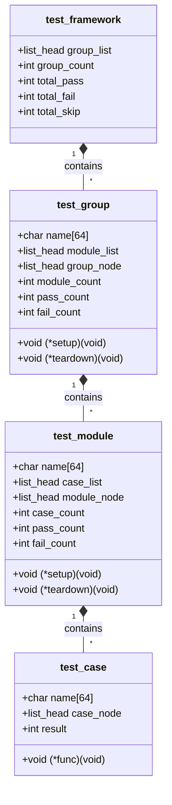
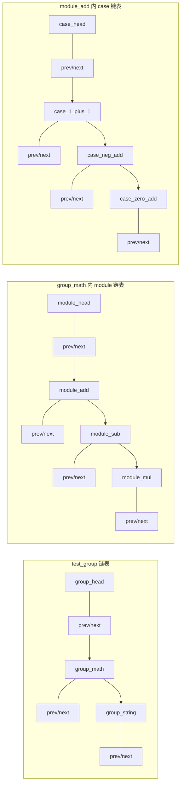
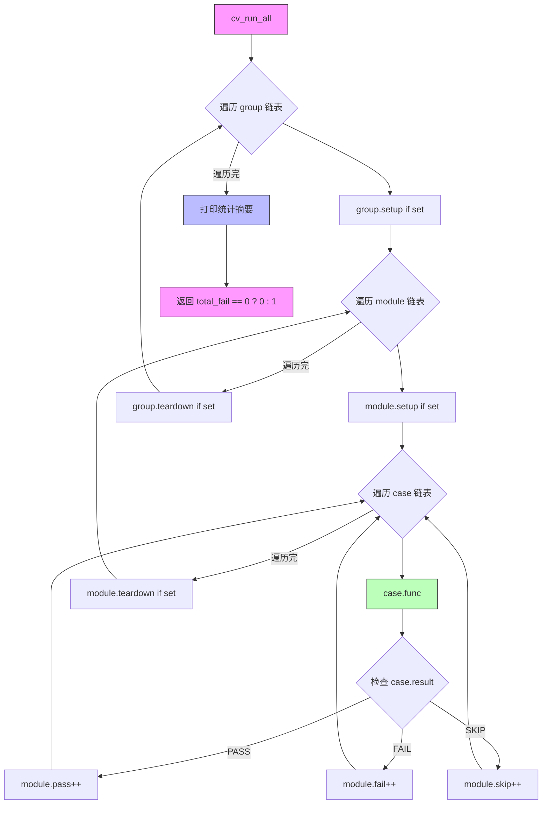
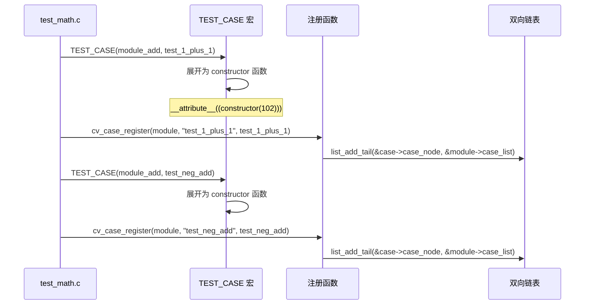
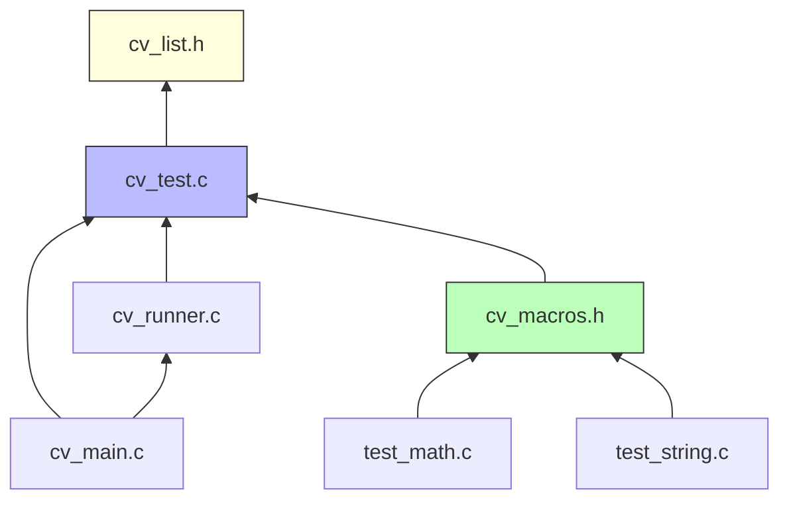

# CV Test Framework - 架构及模块设计

## 1. 总体架构


---

## 2. 核心数据结构

### 2.1 三层结构关系



### 2.2 双向链表节点布局



---

## 3. 目录结构

```
cv_framework/
├── Makefile
├── README.md
├── include/
│   ├── cv_list.h            # Linux 风格双向链表
│   ├── cv_test.h            # 框架核心数据结构与 API 声明
│   └── cv_macros.h          # 用户层便捷宏定义
├── src/
│   ├── cv_test.c            # 框架核心实现（注册、运行、统计）
│   ├── cv_runner.c          # 测试运行器（遍历链表、调用钩子）
│   └── cv_main.c            # main 入口
├── tests/
│   ├── test_math.c          # group_math: 加减乘模块
│   └── test_string.c        # group_string: 拼接/长度/拷贝模块
└── output/
    └── cv_test              # 编译产物
```

---

## 4. 模块职责

### 4.1 `cv_list.h` — 双向链表

仿 Linux kernel `list_head`，提供：

| 函数 | 说明 |
|------|------|
| `LIST_HEAD(name)` | 定义并初始化链表头 |
| `INIT_LIST_HEAD(ptr)` | 初始化链表头 |
| `list_add(new, head)` | 头插法 |
| `list_add_tail(new, head)` | 尾插法 |
| `list_del(entry)` | 从链表中移除 |
| `list_entry(ptr, type, member)` | 通过成员指针获取宿主结构体 |
| `list_for_each(pos, head)` | 正向遍历 |
| `list_for_each_prev(pos, head)` | 反向遍历 |
| `list_for_each_safe(pos, n, head)` | 安全遍历（可中途删除） |

### 4.2 `cv_test.h` — 核心数据结构与 API

```c
/* 测试用例 — 最小单位 */
typedef void (*test_func_t)(void);

typedef struct cv_test_case {
    char            name[64];
    test_func_t     func;
    struct list_head case_node;  /* 链接到 module->case_list */
    int             result;      /* 0=PASS, -1=FAIL, 1=SKIP */
} cv_test_case_t;

/* 测试模块 — 包含多个 test_case */
typedef struct cv_test_module {
    char            name[64];
    struct list_head case_list;   /* 挂载 cv_test_case */
    struct list_head module_node; /* 链接到 group->module_list */
    int             case_count;
    int             pass_count;
    int             fail_count;
    int             skip_count;
    /* 模块级钩子 */
    void (*setup)(void);
    void (*teardown)(void);
} cv_test_module_t;

/* 测试组 — 包含多个 test_module */
typedef struct cv_test_group {
    char            name[64];
    struct list_head module_list; /* 挂载 cv_test_module */
    struct list_head group_node;  /* 链接到 framework->group_list */
    int             module_count;
    int             pass_count;
    int             fail_count;
    int             skip_count;
    /* 组级钩子 */
    void (*setup)(void);
    void (*teardown)(void);
} cv_test_group_t;

/* 框架全局 */
typedef struct cv_test_framework {
    struct list_head group_list;
    int             group_count;
    int             total_pass;
    int             total_fail;
    int             total_skip;
} cv_test_framework_t;

/* API */
cv_test_group_t  *cv_group_register(const char *name);
cv_test_module_t *cv_module_register(cv_test_group_t *group, const char *name);
cv_test_case_t   *cv_case_register(cv_test_module_t *module,
                                    const char *name, test_func_t func);
void              cv_group_set_hooks(cv_test_group_t *g,
                                     void (*setup)(void), void (*teardown)(void));
void              cv_module_set_hooks(cv_test_module_t *m,
                                      void (*setup)(void), void (*teardown)(void));
int               cv_run_all(void);
```

### 4.3 `cv_macros.h` — 用户便捷宏

```c
#define TEST_GROUP(name)                       static cv_test_group_t *name = cv_group_register(#name)
#define TEST_MODULE(group, name)               static cv_test_module_t *name = cv_module_register(group, #name)
#define TEST_CASE(module, name)                static void name(void); \
                                                static cv_test_case_t *name##_ptr = cv_case_register(module, #name, name); \
                                                static void name(void)
#define MODULE_SETUP(module, fn)               cv_module_set_hooks(module, fn, NULL)
#define MODULE_TEARDOWN(module, fn)            cv_module_set_hooks(module, NULL, fn)
#define GROUP_SETUP(group, fn)                 cv_group_set_hooks(group, fn, NULL)
#define GROUP_TEARDOWN(group, fn)              cv_group_set_hooks(group, NULL, fn)
#define CV_ASSERT(cond)                        do { if (!(cond)) { ... } } while(0)
```

### 4.4 `cv_runner.c` — 运行器

执行流程：



### 4.5 `cv_main.c` — 入口

```c
int main(int argc, char *argv[]) {
    /* 1. 自动收集所有测试用例（通过 static 初始化） */
    /* 2. 运行框架 */
    int ret = cv_run_all();
    return ret;
}
```

测试文件通过 `#include` 头文件后，宏定义展开为带 `__attribute__((constructor))` 的自动注册函数。由于纯 C 的 static 初始化顺序不确定，使用 **constructor 优先级** 保证注册顺序。

---

## 5. 自动注册机制



注册优先级：`group(101)` < `module(102)` < `case(103)`，确保先注册组、再模块、最后用例。

---

## 6. 控制台输出示例

```
===========================================
  CV Test Framework v1.0
===========================================

[GROUP] group_math
  [MODULE] module_add ................ SETUP
    [PASS] test_1_plus_1
    [PASS] test_neg_add
    [PASS] test_zero_add
  [MODULE] module_add ................ TEARDOWN
  [MODULE] module_sub ................ SETUP
    [PASS] test_5_minus_3
    [PASS] test_neg_minus_neg
  [MODULE] module_sub ................ TEARDOWN
  [MODULE] module_mul ................ SETUP
    [PASS] test_2_times_3
    [FAIL] test_overflow  <-- expected 0, got -1
  [MODULE] module_mul ................ TEARDOWN

[GROUP] group_string
  [MODULE] module_concat ................ SETUP
    [PASS] test_basic_concat
    [PASS] test_empty_concat
  [MODULE] module_concat ................ TEARDOWN
  [MODULE] module_len ................ SETUP
    [PASS] test_ascii_len
    [PASS] test_empty_len
  [MODULE] module_len ................ TEARDOWN
  [MODULE] module_copy ................ SETUP
    [PASS] test_strcpy_basic
    [PASS] test_overlap_copy
  [MODULE] module_copy ................ TEARDOWN

===========================================
  SUMMARY
===========================================
  Groups:  2  |  Modules: 6  |  Cases: 14
  PASS: 13  |  FAIL: 1  |  SKIP: 0
===========================================
```

---

## 7. 示例测试代码

```c
/* tests/test_math.c */
#include "cv_macros.h"

TEST_GROUP(group_math);

/* --- module_add --- */
TEST_MODULE(group_math, module_add);

static void add_setup(void)   { printf("  [SETUP] module_add\n"); }
static void add_teardown(void){ printf("  [TEARDOWN] module_add\n"); }
MODULE_SETUP(module_add, add_setup);
MODULE_TEARDOWN(module_add, add_teardown);

TEST_CASE(module_add, test_1_plus_1) {
    CV_ASSERT(1 + 1 == 2);
}

TEST_CASE(module_add, test_neg_add) {
    CV_ASSERT(-1 + -1 == -2);
}

/* --- module_sub --- */
TEST_MODULE(group_math, module_sub);

TEST_CASE(module_sub, test_5_minus_3) {
    CV_ASSERT(5 - 3 == 2);
}
```

---

## 8. Makefile 构建设计

```makefile
CC      = gcc
CFLAGS  = -Wall -Wextra -Iinclude
SRCDIR  = src
TESTDIR = tests
OBJDIR  = build
TARGET  = output/cv_test

SRCS    = $(wildcard $(SRCDIR)/*.c)
TESTS   = $(wildcard $(TESTDIR)/*.c)
OBJS    = $(patsubst $(SRCDIR)/%.c, $(OBJDIR)/%.o, $(SRCS))
TESTOBJS= $(patsubst $(TESTDIR)/%.c, $(OBJDIR)/%.o, $(TESTS))

$(TARGET): $(OBJS) $(TESTOBJS)
	$(CC) $(CFLAGS) -o $@ $^

$(OBJDIR)/%.o: $(SRCDIR)/%.c | $(OBJDIR)
	$(CC) $(CFLAGS) -c -o $@ $<

$(OBJDIR)/%.o: $(TESTDIR)/%.c | $(OBJDIR)
	$(CC) $(CFLAGS) -c -o $@ $<

$(OBJDIR):
	mkdir -p $(OBJDIR) output

clean:
	rm -rf $(OBJDIR) $(TARGET)

.PHONY: clean run
run: $(TARGET)
	./$(TARGET)
```

---

## 9. 依赖关系



---

## 10. 设计要点总结

| 设计决策 | 说明 |
|----------|------|
| Linux 双向链表 | `list_head` 嵌入结构体，零开销，支持安全遍历与删除 |
| 三层结构 | Group → Module → Case，层次清晰，钩子粒度可控 |
| `__attribute__((constructor))` | 编译期自动注册，用户无需手动调用注册函数 |
| 优先级控制 | group(101) < module(102) < case(103)，保证注册顺序 |
| CV_ASSERT 宏 | 自动捕获文件名、行号、条件表达式 |
| 模块化编译 | 框架与测试分离，添加新测试只需新建 .c 文件 |
| 统计汇总 | 每个 module/group 独立统计，框架级汇总，便于 CI 判定 |
