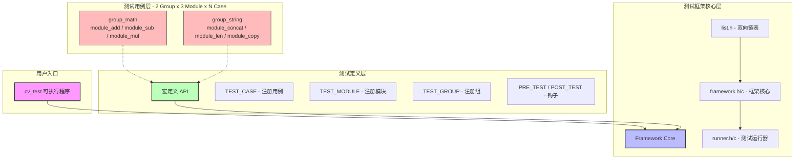
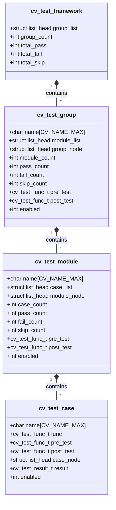
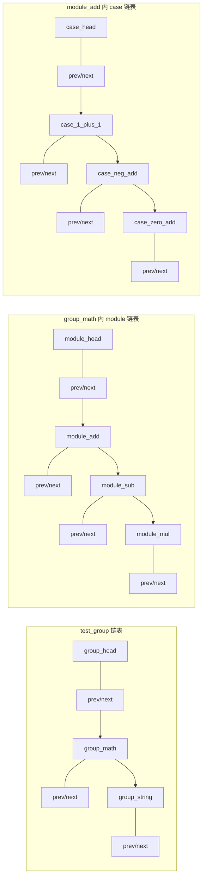
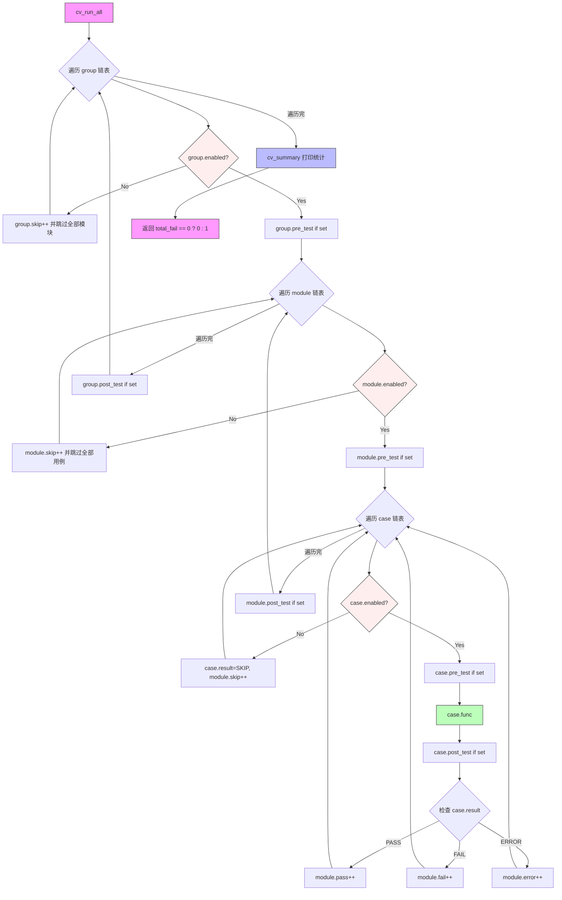
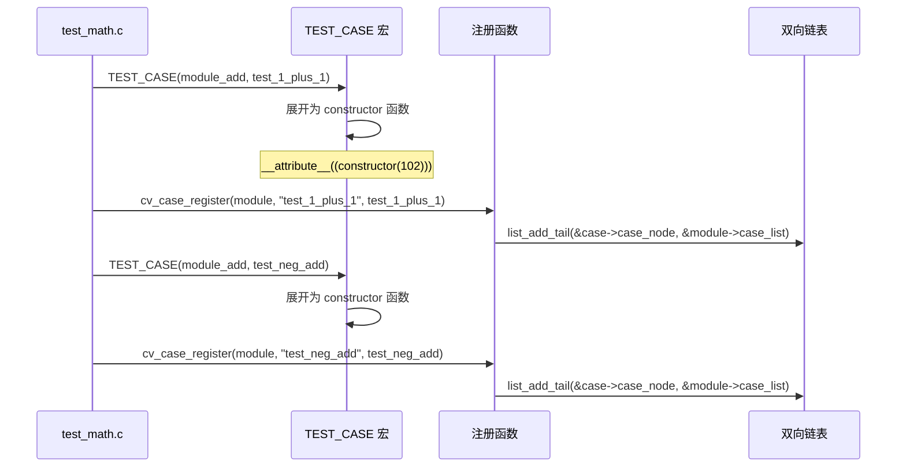
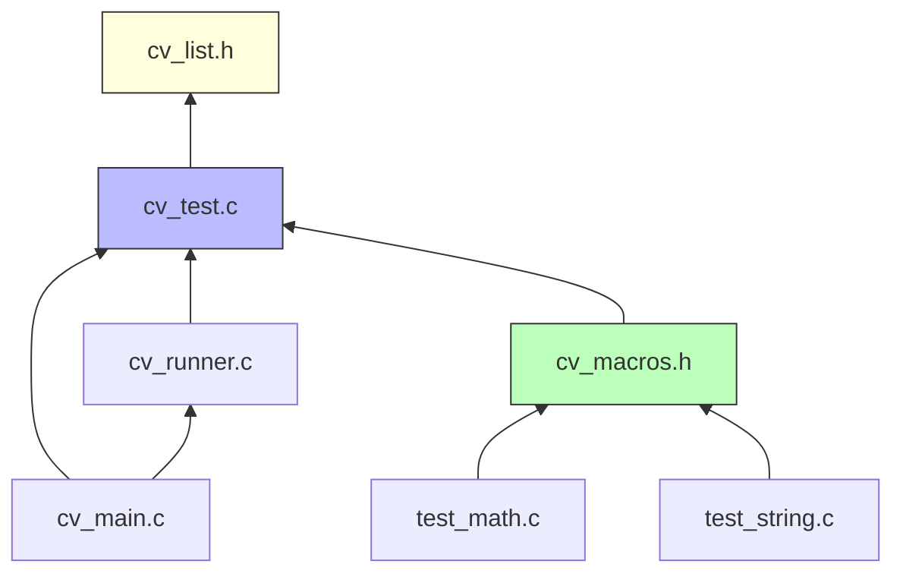

# CV Test Framework - 架构及模块设计

## 1. 总体架构



---

## 2. 核心数据结构

### 2.1 三层结构关系



### 2.2 双向链表节点布局



---

## 3. 目录结构

```
cv_framework/
├── Makefile
├── README.md
├── include/
│   ├── cv_list.h            # Linux 风格双向链表
│   ├── cv_test.h            # 框架核心数据结构与 API 声明
│   └── cv_macros.h          # 用户层便捷宏定义
├── src/
│   ├── cv_test.c            # 框架核心实现（注册、运行、统计）
│   ├── cv_runner.c          # 测试运行器（遍历链表、调用钩子）
│   └── cv_main.c            # main 入口
├── tests/
│   ├── test_math.c          # group_math: 加减乘模块
│   └── test_string.c        # group_string: 拼接/长度/拷贝模块
└── output/
    └── cv_test              # 编译产物
```

---

## 4. 模块职责

### 4.1 `cv_list.h` — 双向链表

仿 Linux kernel `list_head`，提供：

| 函数 | 说明 |
|------|------|
| `LIST_HEAD(name)` | 定义并初始化链表头 |
| `INIT_LIST_HEAD(ptr)` | 初始化链表头 |
| `list_add(new, head)` | 头插法 |
| `list_add_tail(new, head)` | 尾插法 |
| `list_del(entry)` | 从链表中移除 |
| `list_entry(ptr, type, member)` | 通过成员指针获取宿主结构体 |
| `list_for_each(pos, head)` | 正向遍历 |
| `list_for_each_prev(pos, head)` | 反向遍历 |
| `list_for_each_safe(pos, n, head)` | 安全遍历（可中途删除） |

### 4.2 `cv_test.h` — 核心数据结构与 API

```c
#include "cv_list.h"
#include <stddef.h>

/* ---- 类型与常量 ---- */

#define CV_NAME_MAX    64
#define CV_ERR_MSG_MAX 256

typedef void (*cv_test_func_t)(void);

typedef enum {
    CV_RESULT_UNINIT = -1,   /* 未执行 */
    CV_RESULT_PASS   = 0,    /* 通过   */
    CV_RESULT_FAIL   = 1,    /* 失败   */
    CV_RESULT_SKIP   = 2,    /* 跳过   */
    CV_RESULT_ERROR  = 3,    /* 异常   */
} cv_test_result_t;

/* ---- cv_test_case：最小执行单位 ----
 *
 * pre_test / post_test 在 func 前后调用，用于单个用例级的
 * 资源准备与清理（如 mock 初始化、临时文件创建等）。
 * enabled=0 时跳过该用例（结果记为 SKIP）。
 */
typedef struct cv_test_case {
    char                name[CV_NAME_MAX];      /* 用例名称          */
    cv_test_func_t      func;                   /* 测试函数          */
    cv_test_func_t      pre_test;               /* 用例前置回调      */
    cv_test_func_t      post_test;              /* 用例后置回调      */
    struct list_head    case_node;              /* 链接: module->case_list */
    cv_test_result_t    result;                 /* 执行结果          */
    char                errmsg[CV_ERR_MSG_MAX]; /* 失败时的描述信息    */
    int                 enabled;                /* 1=执行, 0=跳过    */
} cv_test_case_t;

/* ---- cv_test_module：包含多个 test_case ----
 *
 * pre_test / post_test 在遍历本模块所有用例的前后各调用一次，
 * 适合模块级的资源分配与释放。
 * enabled=0 时跳过整个模块及其所有用例。
 */
typedef struct cv_test_module {
    char                name[CV_NAME_MAX];       /* 模块名称          */
    struct list_head    case_list;               /* 头: 挂载 cv_test_case  */
    struct list_head    module_node;             /* 链接: group->module_list */
    int                 case_count;              /* 注册的用例总数      */
    int                 pass_count;              /* 通过数             */
    int                 fail_count;              /* 失败数             */
    int                 skip_count;              /* 跳过数             */
    int                 error_count;             /* 异常数             */
    cv_test_func_t      pre_test;                /* 模块前置回调       */
    cv_test_func_t      post_test;               /* 模块后置回调       */
    int                 enabled;                 /* 1=执行, 0=跳过     */
} cv_test_module_t;

/* ---- cv_test_group：包含多个 test_module ----
 *
 * pre_test / post_test 在遍历本组所有模块的前后各调用一次，
 * 适合组级的全局初始化与清理。
 * enabled=0 时跳过整个组及其所有模块/用例。
 */
typedef struct cv_test_group {
    char                name[CV_NAME_MAX];       /* 组名称            */
    struct list_head    module_list;             /* 头: 挂载 cv_test_module  */
    struct list_head    group_node;              /* 链接: framework->group_list */
    int                 module_count;            /* 注册的模块总数      */
    int                 pass_count;              /* 通过数（含子模块）  */
    int                 fail_count;              /* 失败数             */
    int                 skip_count;              /* 跳过数             */
    int                 error_count;             /* 异常数             */
    cv_test_func_t      pre_test;                /* 组前置回调         */
    cv_test_func_t      post_test;               /* 组后置回调         */
    int                 enabled;                 /* 1=执行, 0=跳过     */
} cv_test_group_t;

/* ---- cv_test_framework：全局单例 ---- */
typedef struct cv_test_framework {
    struct list_head    group_list;              /* 头: 挂载 cv_test_group  */
    int                 group_count;             /* 注册的组总数        */
    int                 total_pass;
    int                 total_fail;
    int                 total_skip;
    int                 total_error;
    int                 total_run;               /* 实际执行的用例数    */
} cv_test_framework_t;

/* ---- 公共 API ---- */

/* 获取框架全局单例 */
cv_test_framework_t *cv_framework_get(void);

/* 注册（使用 constructor 宏自动调用，也可手动调用） */
cv_test_group_t  *cv_group_register(const char *name);
cv_test_module_t *cv_module_register(cv_test_group_t *group, const char *name);
cv_test_case_t   *cv_case_register(cv_test_module_t *module,
                                    const char *name, cv_test_func_t func);

/* 设置钩子（pre_test / post_test 传 NULL 表示不设置） */
void cv_group_set_hooks(cv_test_group_t  *g,
                        cv_test_func_t pre_test, cv_test_func_t post_test);
void cv_module_set_hooks(cv_test_module_t *m,
                         cv_test_func_t pre_test, cv_test_func_t post_test);
void cv_case_set_hooks(cv_test_case_t   *c,
                       cv_test_func_t pre_test, cv_test_func_t post_test);

/* 启用/禁用 */
void cv_group_enable(cv_test_group_t  *g,  int enable);
void cv_module_enable(cv_test_module_t *m, int enable);
void cv_case_enable(cv_test_case_t   *c,  int enable);

/* 运行 */
int  cv_run_all(void);
void cv_summary(void);
```

### 4.3 `cv_macros.h` — 用户便捷宏

```c
/* ---- 注册宏（constructor 自动注册） ---- */

#define TEST_GROUP(name)                                               \
    static cv_test_group_t *__cv_grp_##name;                          \
    __attribute__((constructor(101)))                                   \
    static void __cv_reg_grp_##name(void) {                            \
        __cv_grp_##name = cv_group_register(#name);                   \
    }

#define TEST_MODULE(group, name)                                       \
    static cv_test_module_t *__cv_mod_##name;                         \
    __attribute__((constructor(102)))                                   \
    static void __cv_reg_mod_##name(void) {                            \
        __cv_mod_##name = cv_module_register(group, #name);           \
    }

#define TEST_CASE(module, name)                                        \
    static void name(void);                                            \
    __attribute__((constructor(103)))                                   \
    static void __cv_reg_case_##name(void) {                           \
        cv_case_register(module, #name, name);                        \
    }                                                                  \
    static void name(void)

/* ---- 钩子宏 ---- */

#define GROUP_PRE_TEST(group, fn)       cv_group_set_hooks(group, fn, NULL)
#define GROUP_POST_TEST(group, fn)      cv_group_set_hooks(group, NULL, fn)
#define MODULE_PRE_TEST(module, fn)     cv_module_set_hooks(module, fn, NULL)
#define MODULE_POST_TEST(module, fn)    cv_module_set_hooks(module, NULL, fn)
#define CASE_PRE_TEST(case_ptr, fn)     cv_case_set_hooks(case_ptr, fn, NULL)
#define CASE_POST_TEST(case_ptr, fn)    cv_case_set_hooks(case_ptr, NULL, fn)

/* ---- 断言宏 ---- */

#define CV_ASSERT(cond)                       do {                                     \
        if (!(cond)) {                                                               \
            cv_test_current_case_fail(__FILE__, __LINE__, #cond);                    \
        }                                                                           \
    } while (0)

#define CV_ASSERT_EQ(a, b)                   do {                                     \
        long _ea = (long)(a), _eb = (long)(b);                                       \
        if (_ea != _eb) {                                                            \
            char _ebuf[CV_ERR_MSG_MAX];                                              \
            snprintf(_ebuf, sizeof(_ebuf), "%s != %s  (%ld vs %ld)",               \
                     #a, #b, _ea, _eb);                                               \
            cv_test_current_case_fail(__FILE__, __LINE__, _ebuf);                    \
        }                                                                           \
    } while (0)
```

### 4.4 `cv_runner.c` — 运行器

执行流程：



### 4.5 `cv_main.c` — 入口

```c
int main(int argc, char *argv[]) {
    /* 1. 自动收集所有测试用例（通过 static 初始化） */
    /* 2. 运行框架 */
    int ret = cv_run_all();
    return ret;
}
```

测试文件通过 `#include` 头文件后，宏定义展开为带 `__attribute__((constructor))` 的自动注册函数。由于纯 C 的 static 初始化顺序不确定，使用 **constructor 优先级** 保证注册顺序。

---

## 5. 自动注册机制



注册优先级：`group(101)` < `module(102)` < `case(103)`，确保先注册组、再模块、最后用例。

---

## 6. 控制台输出示例

```
===========================================
  CV Test Framework v1.0
===========================================

[GROUP] group_math
  [GROUP PRE_TEST] group_math init resources...
  [MODULE] module_add
    [MODULE PRE_TEST] init adder context
      [CASE PRE_TEST] setup operand buffer
      [PASS] test_1_plus_1
      [CASE POST_TEST] cleanup operand buffer
      [CASE PRE_TEST] setup operand buffer
      [PASS] test_neg_add
      [CASE POST_TEST] cleanup operand buffer
      [CASE PRE_TEST] setup operand buffer
      [PASS] test_zero_add
      [CASE POST_TEST] cleanup operand buffer
    [MODULE POST_TEST] destroy adder context
  [MODULE] module_sub
    [PASS] test_5_minus_3
    [PASS] test_neg_minus_neg
  [MODULE] module_mul
    [PASS] test_2_times_3
    [FAIL] test_overflow  <-- test_math.c:42: expected 0, got -1
  [GROUP POST_TEST] group_math release resources...

[GROUP] group_string
  [MODULE] module_concat
    [PASS] test_basic_concat
    [PASS] test_empty_concat
  [MODULE] module_len
    [PASS] test_ascii_len
    [PASS] test_empty_len
  [MODULE] module_copy
    [PASS] test_strcpy_basic
    [PASS] test_overlap_copy

===========================================
  SUMMARY
===========================================
  Groups:  2  |  Modules: 6  |  Cases: 14
  PASS: 13  |  FAIL: 1  |  ERROR: 0  |  SKIP: 0
===========================================
```

---

## 7. 示例测试代码

```c
/* tests/test_math.c */
#include "cv_macros.h"

TEST_GROUP(group_math);

/* --- 组级钩子 --- */
static void math_pre(void)  { printf("[GROUP PRE_TEST] group_math init resources...\n"); }
static void math_post(void) { printf("[GROUP POST_TEST] group_math release resources...\n"); }
GROUP_PRE_TEST(group_math, math_pre);
GROUP_POST_TEST(group_math, math_post);

/* ==================== module_add ==================== */
TEST_MODULE(group_math, module_add);

static void add_pre(void)  { printf("    [MODULE PRE_TEST] init adder context\n"); }
static void add_post(void) { printf("    [MODULE POST_TEST] destroy adder context\n"); }
MODULE_PRE_TEST(module_add, add_pre);
MODULE_POST_TEST(module_add, add_post);

TEST_CASE(module_add, test_1_plus_1) {
    CV_ASSERT(1 + 1 == 2);
}

TEST_CASE(module_add, test_neg_add) {
    CV_ASSERT(-1 + -1 == -2);
}

/* 用例级钩子（可选） */
static void case_buf_pre(void)  { printf("      [CASE PRE_TEST] setup operand buffer\n"); }
static void case_buf_post(void) { printf("      [CASE POST_TEST] cleanup operand buffer\n"); }

TEST_CASE(module_add, test_zero_add) {
    /* 手动设置 case 级钩子 */
    CASE_PRE_TEST(__cv_case_test_zero_add, case_buf_pre);
    CASE_POST_TEST(__cv_case_test_zero_add, case_buf_post);
    CV_ASSERT(0 + 0 == 0);
}

/* ==================== module_sub ==================== */
TEST_MODULE(group_math, module_sub);

TEST_CASE(module_sub, test_5_minus_3) {
    CV_ASSERT(5 - 3 == 2);
}

TEST_CASE(module_sub, test_neg_minus_neg) {
    CV_ASSERT(-1 - (-1) == 0);
}
```

---

## 8. Makefile 构建设计

```makefile
CC      = gcc
CFLAGS  = -Wall -Wextra -Iinclude
SRCDIR  = src
TESTDIR = tests
OBJDIR  = build
TARGET  = output/cv_test

SRCS    = $(wildcard $(SRCDIR)/*.c)
TESTS   = $(wildcard $(TESTDIR)/*.c)
OBJS    = $(patsubst $(SRCDIR)/%.c, $(OBJDIR)/%.o, $(SRCS))
TESTOBJS= $(patsubst $(TESTDIR)/%.c, $(OBJDIR)/%.o, $(TESTS))

$(TARGET): $(OBJS) $(TESTOBJS)
	$(CC) $(CFLAGS) -o $@ $^

$(OBJDIR)/%.o: $(SRCDIR)/%.c | $(OBJDIR)
	$(CC) $(CFLAGS) -c -o $@ $<

$(OBJDIR)/%.o: $(TESTDIR)/%.c | $(OBJDIR)
	$(CC) $(CFLAGS) -c -o $@ $<

$(OBJDIR):
	mkdir -p $(OBJDIR) output

clean:
	rm -rf $(OBJDIR) $(TARGET)

.PHONY: clean run
run: $(TARGET)
	./$(TARGET)
```

---

## 9. 依赖关系



---

## 10. 设计要点总结

| 设计决策 | 说明 |
|----------|------|
| Linux 双向链表 | `list_head` 嵌入结构体，零开销，支持安全遍历与删除 |
| 三层结构 | Group → Module → Case，层次清晰，钩子粒度可控 |
| 三级 pre/post_test | group / module / case 各自拥有 pre_test + post_test，层级嵌套调用 |
| enabled 字段 | 三层均支持 enable/disable，禁用时整棵子树跳过 |
| result + errmsg | case 记录枚举结果与错误描述，失败时可追溯文件名/行号 |
| error 状态 | 区分 FAIL（断言失败）与 ERROR（运行时异常如段错误） |
| `__attribute__((constructor))` | 编译期自动注册，用户无需手动调用注册函数 |
| 优先级控制 | group(101) < module(102) < case(103)，保证注册顺序 |
| CV_ASSERT / CV_ASSERT_EQ | 自动捕获文件名、行号、条件表达式；EQ 额外打印实际值 |
| 模块化编译 | 框架与测试分离，添加新测试只需新建 .c 文件 |
| 统计汇总 | 每个 module/group 独立统计 pass/fail/skip/error，框架级汇总便于 CI 判定 |
